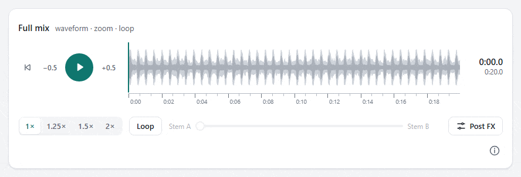
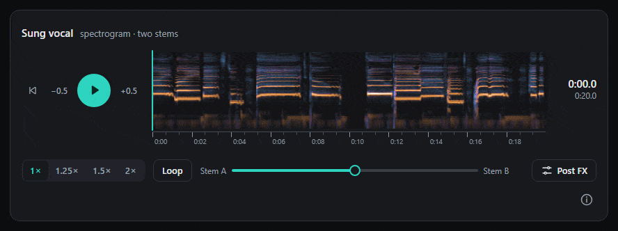
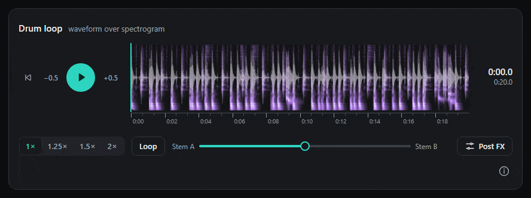
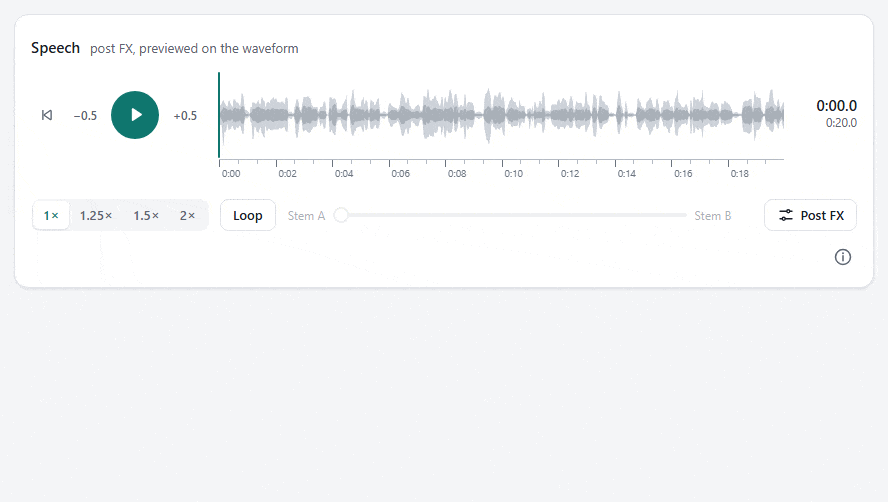
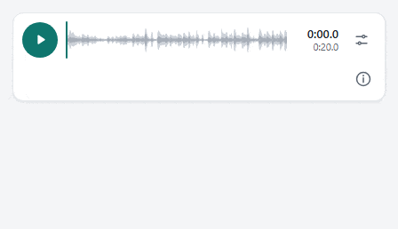
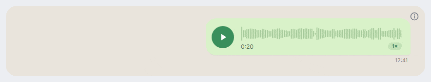
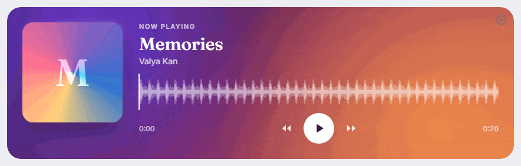
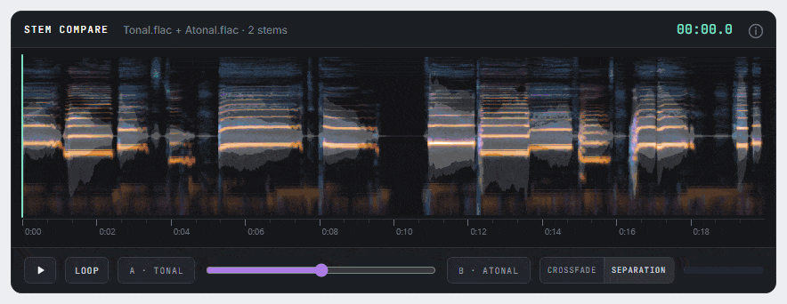
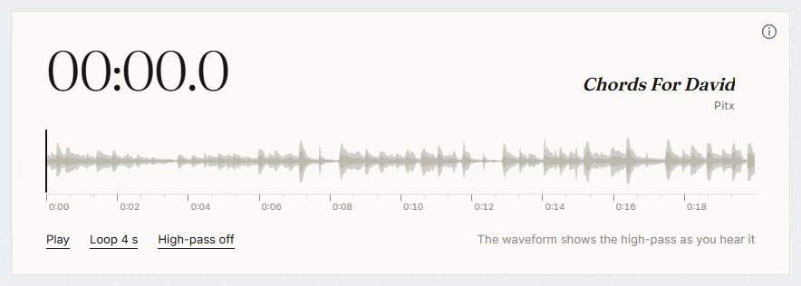
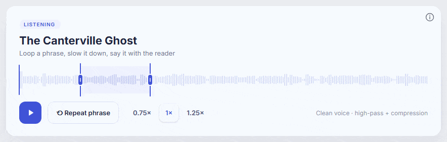

# RT-DSPPLR

**Web audio player with real-time DSP — by SAIT Digital.**

Add playback, pitch-preserving speed, looping and an interactive waveform to
your application. Use the ready-made React player or build your own interface
with the framework-independent audio engine. TypeScript types are included.

## Features

- **Playback and navigation:** seek, step through audio and loop a selected range.
- **Pitch-preserving speed:** worker-based processing prepares a new speed while
  playback continues, then switches at the live position.
- **Real-time DSP:** high-pass filter, compression, output gain and limiting.
- **Interactive waveform:** click to seek, drag to loop, zoom and pan.
- **Live spectrogram:** both stems on a logarithmic axis, repainted as the mix moves.
- **Two-track mixer:** stems A and B play in sync under one slider. What goes on
  A and B is up to you: before and after processing, two mixes of a song, or
  the two parts of a separation, with the original in the middle.
- **React component:** responsive layouts, light/dark themes and keyboard controls.
- **Custom interfaces:** a headless engine, and the timeline, the spectrogram and the
  author menu without React, for any framework.

Ordinary files are decoded into memory in full; DSP controls operate during
playback, and pitch-preserving speed changes prepare a rendered variant. Long
recordings can instead be **prepared once on the server** and played segment by
segment: the whole timeline (waveform, DSP preview, spectrogram) is there at once,
audio is fetched around the playhead, speed keeps the pitch in realtime, and the
A⇄B knob blends the recording with one of its named, server-made stems.

## Packages

| Package | | |
|---|---|---|
| [`@saitdigital/rt-dspplr`](packages/rt-dspplr/README.md) | browser | The player: headless engine, React component, timeline, spectrogram, prepared-file playback, the file formats (`./format`) and the manifest schema. |
| [`@saitdigital/rt-dspplr-prepare`](packages/rt-dspplr-prepare/README.md) | Node ≥ 20.19 | `rtd-prepare` CLI and API: segments, overview files and named stems for long recordings. |

The prepared-file format is specified in [docs/manifest.md](docs/manifest.md).

## The ready-made player

Waveform with zoom, pan and loop:



Two stems on a live spectrogram, each in its own colour, following the mix slider:



The waveform as an outline over the spectrogram:



High-pass, compression and output gain, previewed on the waveform as they move:



The compact layout for narrow containers:



## Your own interface on the same engine

The same engine under five interfaces built with `useAudioPlayer()` and
`<Timeline>`. Their code is in [examples/gallery](examples/gallery), one file per
design: run `npm ci && npm run gallery`, then choose or drop your own audio. The
interfaces are examples and are not part of the package.











Audio in the animations:

- *Memories* by Valya Kan, [CC BY 4.0](https://archive.org/details/yarn020)
- *Ophelia's Song* (vocals) by musetta, sung by Marinella Mastrosimone,
  [CC BY 2.5](https://ccmixter.org/files/musetta/6343), split into two stems with EQSEP 2
- *Chords For David* by Pitx, [CC BY 3.0](https://ccmixter.org/files/Pitx/30638)
- *Muzikemo Drum Essentials* by Muzikemo, [CC BY 4.0](https://archive.org/details/MuzikemoDrumEssentials),
  split into two stems with EQSEP 2
- *The Canterville Ghost* by Oscar Wilde, read by David Barnes for
  [LibriVox](https://archive.org/details/canterville_ghost_librivox), public domain

## Install

```bash
npm install @saitdigital/rt-dspplr
npm install @saitdigital/rt-dspplr-prepare   # on the server, for long recordings
```

The React component additionally needs `react >= 18` and your application's React
renderer. The headless engine has no React requirement. The package is ESM-only.

## React quick start

```tsx
import { AudioPlayer } from '@saitdigital/rt-dspplr/react';
import '@saitdigital/rt-dspplr/styles.css';

export function App() {
    return (
        <AudioPlayer
            src="/audio/example.ogg"
            title="Example track"
            theme="dark"
        />
    );
}
```

The component manages loading and playback. Its author menu is built in: right-click
the player, use the context-menu key / Shift+F10, or tap the ⓘ button.
For playlists and custom controls, use
[`useAudioPlayer()` and the controlled component](packages/rt-dspplr/README.md#react-quick-start).

## Your own interface

```ts
import { createAudioPlayer } from '@saitdigital/rt-dspplr';

const root = document.querySelector<HTMLElement>('#player')!;
const player = createAudioPlayer({ element: root });

root.querySelector<HTMLButtonElement>('[data-play]')!.onclick = async () => {
    await player.play('/audio/example.ogg');
};
```

Give the player the element your interface lives in, and its author menu is there:
right-click, the context-menu key / Shift+F10, and a tappable ⓘ button. It needs no
framework and no stylesheet. Playback needs an element on the page; without one,
`play()` rejects with an error that says so. With React, put `ref={player.ref}` from
`useAudioPlayer()` on your root, or call `player.mount(element)` in any framework.

## Long recordings

```bash
npx rtd-prepare talk.wav public/media/talk
```

```ts
await player.play({ manifest: '/media/talk/manifest.json' });
```

See [the prepare package](packages/rt-dspplr-prepare/README.md) for the CLI, the API,
named stems and server-side processors, and
[Long recordings](packages/rt-dspplr/README.md#long-recordings-prepared-files) for the
player side.

## Documentation

- [API, React examples, themes, browser support and memory](packages/rt-dspplr/README.md)
- [Preparing long recordings](packages/rt-dspplr-prepare/README.md) and [the manifest format](docs/manifest.md)
- [Time-stretch strategies](packages/rt-dspplr/README.md#time-stretch-strategies)
- [Workers, bundlers and CSP](packages/rt-dspplr/README.md#bundlers-workers-csp)

Rubber Band is optional and not bundled. The built-in vocoder works without it.
Rubber Band is GPL, which does not combine with this player's license: shipping the
Rubber Band entry in an application other people get, a web page included, needs a
commercial Rubber Band licence. See [Rubber Band's terms](https://breakfastquay.com/rubberband/license.html).

## License and attribution

Free to use, including in commercial, closed-source apps and hosted services, on
two conditions:

1. **The credit stays.** Right-clicking the player shows **RT-DSPPLR by SAIT
   Digital** with a link to the project; on touch devices the ⓘ button does. The
   player does this by itself in any interface. Do not remove or hide it.
2. **Changes to the player stay open.** If you ship a modified player, or serve it
   to people outside your organization, publish its source under the same license.
   Your own application code stays closed. Options, themes and your own interface
   on the public API are not modifications.

The [license](LICENSE.md) fits on one page. It is a custom, source-available
license, not an OSI-approved one.

The examples in [examples/](examples) and the code samples in the READMEs are
under MIT No Attribution ([examples/LICENSE.md](examples/LICENSE.md)): copy and
change them freely. The player they use keeps its own license.

## Try the demo locally

The repository includes a development workspace and a Vite demo for exploring or
developing the player. Consumers install the package without the workspace.

With Node.js 22+ and npm, from a clone of this repository:

```bash
npm ci
npm run dev
```

Open **http://localhost:5173**. Drop audio onto the demo or place files in
`examples/demo/storage/clips/`. Uploaded files are stored in that local folder.
Put `example.b.wav` next to `example.wav` to give it a stem B.
Switch themes and stretch engines, explore the waveform, and copy the usage example.

The demo includes Rubber Band for evaluation; consumer installations do not pull
it in automatically. Sample audio is not committed. Optionally run `npm run samples`
with Bash and Docker to generate synthetic examples: stem A is a degraded copy,
stem B the clean synthesis it was made from.

## Development

```text
packages/rt-dspplr/          the player: source, documentation and tests
packages/rt-dspplr-prepare/  the prepare step (Node): source, documentation and tests
examples/demo/               demo consuming the built packages
examples/gallery/    the five interfaces shown above
```

```bash
npm run build          # both packages, demo and gallery
npm run typecheck
npm test
npx playwright install chromium
npm run test:browser   # audio, workers, React and attribution UI
npm run test:package   # install the tarballs in an isolated consumer (the prepare CLI's output played in Chromium)
```

After changing library source, run `npm run build:lib` and refresh the demo.
The demo consumes `dist/`, not library source. Build checks verify the optional
Rubber Band boundary and generate a bundle size report.

See [RELEASING.md](RELEASING.md) for publication steps and [CHANGELOG.md](CHANGELOG.md) for what changed.
